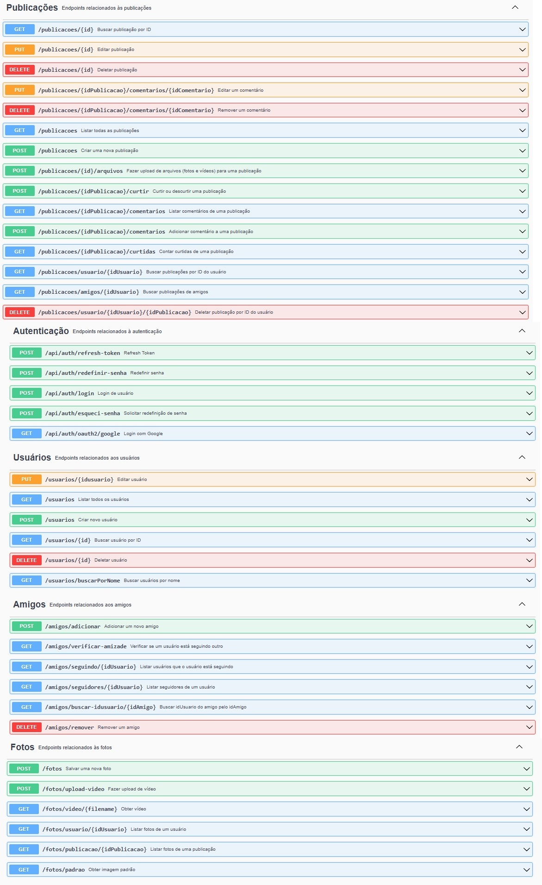
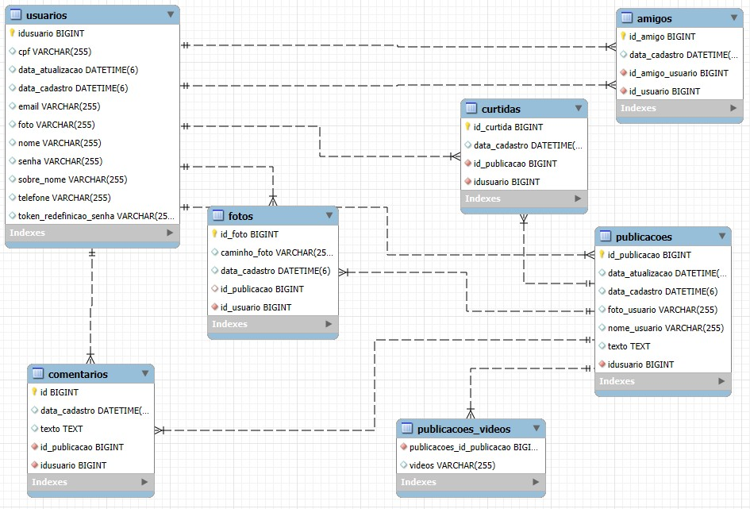

# 🌍 Projeto Alerta Natural

O **Alerta Natural** é uma plataforma inovadora para o acompanhamento de desastres naturais, como enchentes e tempestades. Além de fornecer previsões meteorológicas em tempo real, o sistema conta com uma rede social integrada, permitindo que os usuários compartilhem fotos e vídeos das ocorrências em suas regiões.

---

## 🚀 Tecnologias Utilizadas

- **Java / Spring Boot / Spring Security**  
- **Banco de Dados:** MySQL  
- **JPA / Hibernate**  
- **Swagger** (para documentação de API)  
- **Google OAuth Client Library**  

--- 

## 📦 Estrutura do Projeto

```plaintext
/projeto-Alerta-Natural-Backend  
│── src/  
│   ├── main/  
│   │   ├── java/com.br.alertanatural/  
│   │   │   ├── Config/  
│   │   │   ├── controllers/  
│   │   │   ├── DTOs/  
│   │   │   ├── models/  
│   │   │   ├── repositories/  
│   │   │   ├── services/  
│   │   │   ├── util/  
│── resources/  
│   ├── application.properties  
│── pom.xml  
│── README.md  
```
---
### 📖 Como Rodar o Projeto  

### 🖥️ Pré-requisitos  
* Antes de começar, certifique-se de ter instalado:
* Uma IDE (Intellij de preferencia)
* Java 17+
* MySQL
---
### 🔧 Configuração do Ambiente  

### Clone o repositório:
```
 git clone https://github.com/kleberton-santos/alerta-natural.git
```
### Abra o Intellij:
* Menu / Open / Folder / Selecione a pasta do projeto

### Abra o Terminal direto no Intellij mesmo:
* Build do projeto:
```
 mvn clean install
```

---
### Rodando o Projeto:  
* Basta iniciar o projeto, e caso tenha um postman pode testar os endpoints

### 📌 Funcionalidades Principais:

---

🔴 Monitoramento de Desastres: Acompanhe eventos como enchentes e tempestades em tempo real.

🌦 Previsão do Tempo: Consulte as condições climáticas de sua região.

📸 Rede Social: Poste fotos e vídeos sobre ocorrências e interaja com outros usuários.

❤️ Interação Social: Curta e comente publicações de outros usuários.

🤝 Adição de Amigos: Conecte-se com outras pessoas para compartilhar informações.

---

### 📌 Endpoints Principais   
  

---

### 📦 Banco de Dados  
&nbsp;&nbsp;&nbsp;&nbsp;  &nbsp;&nbsp;   

---
### application.properties  
```
 spring.application.name=alerta-natura

spring.datasource.url=jdbc:mysql://localhost:3306/alertanatural
spring.datasource.username=SEU_USUARIO
spring.datasource.password=SUA_SENHA
spring.datasource.driver-class-name=com.mysql.cj.jdbc.Driver

spring.jpa.hibernate.ddl-auto=update

spring.jpa.properties.hibernate.dialect=org.hibernate.dialect.MySQLDialect

jwt.secret=SEU_JWT_SECRET
jwt.expiration=86400000
jwt.refresh-token-expiration=604800000

diretorio.fotos=CAMINHO_PARA_FOTOS

spring.security.oauth2.client.registration.google.client-id=SEU_GOOGLE_CLIENT_ID
spring.security.oauth2.client.registration.google.client-secret=SEU_GOOGLE_CLIENT_SECRET
spring.security.oauth2.client.registration.google.scope=email,profile

spring.mail.host=SMT
spring.mail.port=PORTA
spring.mail.username=SEU_EMAIL
spring.mail.password=SUA_SENHA_DE_APP
spring.mail.properties.mail.smtp.auth=true
spring.mail.properties.mail.smtp.starttls.enable=true
```
---
### 📜 Licença

Este projeto está licenciado sob a MIT License 
---
#### 📌 Desenvolvido por Kleberton Santos, Dislene Portela, Julio, Leon e Marcelo.
---
### 🌟 Contribuições são bem-vindas!
#### Se você quiser contribuir para o projeto, sinta-se à vontade para abrir uma issue ou enviar um pull request.
---
### 📌 Contato
#### Para mais informações, entre em contato com os desenvolvedores ou visite o repositório do projeto.
